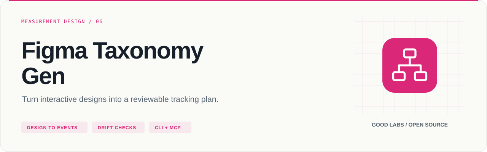
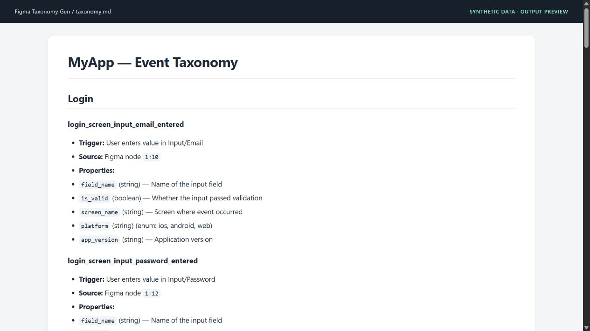

<p align="center">
  
</p>

# Figma Taxonomy Gen

Turn interactive designs into a reviewable tracking plan.

[](https://github.com/arcbaslow/figma-taxonomy-gen/actions/workflows/ci.yml)
[](https://github.com/arcbaslow/figma-taxonomy-gen/releases)
[](#installation)
[](LICENSE)

[Quick start](#quick-start) · [Example output](#example-output) · [Tests](#tests) · [Releases](#releases) · [Contributing](CONTRIBUTING.md)

A CLI and optional MCP server that extracts interactive elements from a Figma file and generates a first-pass event taxonomy. Review the output as a tracking plan, then detect drift when the design changes.

```text
Figma REST API or local fixture
  → interactive elements and screen context
  → configurable event names and properties
  → Excel · CSV · JSON · Markdown
```

## What you can do

| Capability | Result |
| --- | --- |
| Extract | Detect buttons, inputs, toggles, tabs and other interactive nodes |
| Name | Apply configurable patterns, styles and action verbs |
| Enrich | Attach global properties and name-matching rules; optionally infer properties with Anthropic |
| Export | Excel review sheet, Amplitude-oriented CSV, structured JSON and Markdown |
| Validate | Compare a saved taxonomy with a Figma file or local fixture |
| Diff | Compare two taxonomy files; return a failing CI exit code on changes |
| Integrate | Optional MCP tools and an Amplitude Taxonomy API push command |

## Installation

Requires **Python 3.11+**. Install the published CLI with `python -m pip install figma-taxonomy-gen`, or clone the repository to use the bundled fixtures and current source:

```bash
git clone https://github.com/arcbaslow/figma-taxonomy-gen.git
cd figma-taxonomy-gen
python -m venv .venv
```

Activate with `source .venv/bin/activate` on macOS/Linux or `.venv\Scripts\Activate.ps1` in Windows PowerShell, then:

```bash
python -m pip install -e ".[dev]"
```

For uv, use `uv sync --extra dev` and prefix commands with `uv run`. AI and MCP are optional extras; the core extractor needs neither an LLM nor an API key when using a fixture.

## Quick start

Try the included banking-app fixture with **no credentials**:

```bash
figma-taxonomy extract --fixture tests/fixtures/banking_app.json --format excel,csv,json,markdown --output output
figma-taxonomy validate output/taxonomy.json --fixture tests/fixtures/banking_app.json --exit-code
```

For a live design, set `FIGMA_TOKEN` to a Figma personal access token in your environment, then:

```bash
figma-taxonomy extract https://www.figma.com/design/YOUR_FILE_KEY/MyApp --output output
```

| Output | Purpose |
| --- | --- |
| `taxonomy.xlsx` | Tracking-plan review in a spreadsheet |
| `taxonomy.csv` | Amplitude-oriented event/property import |
| `taxonomy.json` | Structured taxonomy with Figma node IDs for validation and tooling |
| `taxonomy.md` | Human-readable plan for a pull request or wiki |

## Example output



The screenshot shows the **actual generated Markdown**, rendered for documentation. It uses the synthetic [banking-app fixture](tests/fixtures/banking_app.json), not a private Figma file. Explore the [generated example](examples/demo/taxonomy.md), [JSON](examples/demo/taxonomy.json) and [CSV](examples/demo/taxonomy.csv).

## Configuration

The default naming pattern is `{screen}_{element}_{action}`. Adjust [taxonomy.config.yaml](taxonomy.config.yaml), or pass a different file:

```yaml
naming:
  style: snake_case
  pattern: "{screen}_{element}_{action}"
  max_event_length: 64
  actions:
    button: clicked
    input: entered
    toggle: toggled
    tab: viewed

property_rules:
  - match: "*_clicked"
    add:
      - name: element_text
        type: string

output:
  formats: [excel, csv, json, markdown]
```

```bash
figma-taxonomy extract --fixture tests/fixtures/banking_app.json --config taxonomy.config.yaml --format json,markdown
```

Detection uses component names, node types and prototype interactions. Decorative nodes are excluded by the configured heuristics. Review the output against the product's real behavior: design files cannot establish whether an event is implemented or fires correctly.

## Drift checks

```bash
# Compare the plan with the current design.
figma-taxonomy validate output/taxonomy.json --figma https://www.figma.com/design/YOUR_FILE_KEY/MyApp --exit-code

# Compare two saved taxonomy versions.
figma-taxonomy diff previous/taxonomy.json output/taxonomy.json --exit-code
```

Node IDs preserve the link to Figma so the comparison can report additions, removals, renames and property changes. `--exit-code` returns a nonzero status for drift. The repository includes a [composite drift-check action](.github/actions/drift-check/action.yml); pin the action to a reviewed release or commit in your workflow. Schedule a check as well if you need to detect design edits that do not modify a file in Git.

## Optional integrations

### AI property enrichment

```bash
python -m pip install -e ".[ai]"
# Set ANTHROPIC_API_KEY in your environment before using --ai.
figma-taxonomy extract --fixture tests/fixtures/banking_app.json --ai
```

The CLI estimates the request cost and asks for confirmation. `--yes` skips that prompt. AI sends design context to Anthropic and may incur API charges; estimates depend on the configured model and input. The core rule engine remains usable without this extra.

### MCP server

```bash
python -m pip install -e ".[mcp]"
figma-taxonomy-mcp
```

| Tool | Purpose |
| --- | --- |
| `extract_taxonomy` | Extract from a Figma URL or local fixture |
| `validate_taxonomy` | Compare a saved taxonomy with a design |
| `export_taxonomy` | Write JSON, CSV, Markdown or Excel |

Set the client's command to `figma-taxonomy-mcp`, or the absolute path to that executable in the virtual environment. Supply `FIGMA_TOKEN` through the environment for live extraction. See [mcp_server.py](src/figma_taxonomy/mcp_server.py) for tool registration.

### Amplitude push

```bash
figma-taxonomy push output/taxonomy.json --dry-run
```

A real push requires Amplitude Taxonomy API access and `AMPLITUDE_API_KEY` / `AMPLITUDE_SECRET_KEY`. Check access for your Amplitude project. **Removing `--dry-run` performs writes immediately**; there is no extra confirmation prompt. CSV export remains available independently of Taxonomy API access.

## Tests

```bash
python -m pip install -e ".[dev,ai,mcp]"
python -m pytest -q
python -m ruff check src/ tests/
python -m pip install build
python -m build
```

With uv: `uv sync --extra dev --extra ai --extra mcp`, then `uv run pytest -q`, `uv run ruff check src/ tests/` and `uv build`.

Tests use local fixtures and mocked services. They cover extraction, naming, configuration, all output formats, drift, CLI handling, AI response merging, Amplitude push and MCP tool functions. CI tests **Python 3.11–3.13 on Ubuntu and Windows**, with a separate lint/build job. See the [release verification](docs/VERIFICATION.md).

## Repository map

| Path | Purpose |
| --- | --- |
| [src/figma_taxonomy/](src/figma_taxonomy/) | CLI, extraction, naming, exporters and integrations |
| [tests/](tests/) | Tests and sample Figma responses |
| [examples/demo/](examples/demo/) | Reproducible generated tracking plan |
| [taxonomy.config.yaml](taxonomy.config.yaml) | Naming, detection and property rules |
| [docs/](docs/) | Usage documentation, release notes and verification |

## Releases

**[v0.4.2](https://github.com/arcbaslow/figma-taxonomy-gen/releases/tag/v0.4.2)** — see the [release notes](docs/RELEASE_NOTES.md) for this release and the [changelog](CHANGELOG.md) for project history.

GitHub Releases include downloadable artifacts and checksums. Package-registry publication is a separate, opt-in workflow; a GitHub release does not imply that the same version is available on PyPI or npm. Maintainers can follow the [release guide](docs/RELEASING.md).

## Contributing

Read [CONTRIBUTING.md](CONTRIBUTING.md), run the checks above, and include a minimal reproduction for bugs. Report vulnerabilities through [SECURITY.md](SECURITY.md).

## Related tools

| Project | Use it for |
| --- | --- |
| [Google Ads Agents](https://github.com/arcbaslow/google-ads-agents) | Paid media audits, tracking checks and reviewed changes. |
| [Google Analytics Agent](https://github.com/arcbaslow/google-analytics-agent) | GA4 data quality, funnels and property management. |
| [Search Console Agent](https://github.com/arcbaslow/google-search-console-agent) | Search performance, indexing and page experience. |
| [Meta Ads Agents](https://github.com/arcbaslow/meta-ads-agents) | Campaign performance, creative fatigue and event health. |
| [GTM Diff](https://github.com/arcbaslow/gtm-diff) | Review the changes in your Google Tag Manager exports. |

Maintained by [Good Labs](https://goodlabs.kz) — measurement implementation, tracking plans and analytics audits.

## License

[MIT](LICENSE) © Dilshat Rakhimov. This is an independent project; it is not an official product of the platform vendors.
