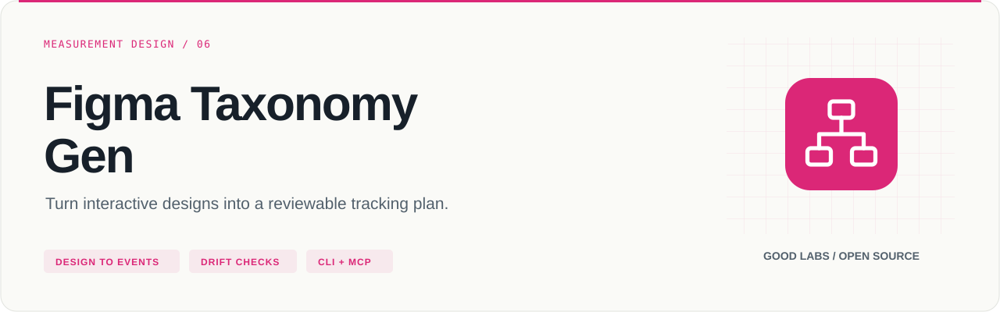
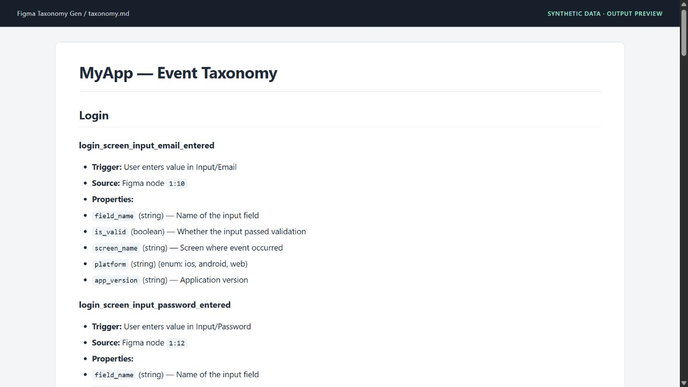

<p align="center">
  
</p>

# Figma Taxonomy Gen

Turn interactive designs into a reviewable tracking plan.

[](https://github.com/arcbaslow/figma-taxonomy-gen/actions/workflows/ci.yml)
[](https://github.com/arcbaslow/figma-taxonomy-gen/releases)
[](#installation)
[](LICENSE)

[Quick start](#quick-start) · [Example output](#example-output) · [Tests](#tests) · [Releases](#releases) · [Contributing](CONTRIBUTING.md)

A CLI and optional MCP server that extracts interactive elements from a Figma file and generates a first-pass event taxonomy. Review the output as a tracking plan, then detect drift when the design changes.

```text
Figma REST API or local fixture
  → interactive elements and screen context
  → configurable event names and properties
  → Excel · CSV · JSON · Markdown
```

## What you can do

| Capability | Result |
| --- | --- |
| Extract | Detect buttons, inputs, toggles, tabs and other interactive nodes |
| Explain | Inspect node inclusion, exclusions and generated events with `--explain decisions.json` |
| Name | Apply configurable patterns, styles and action verbs |
| Enrich | Attach global properties and name-matching rules; optionally infer properties with Anthropic |
| Export | Excel and CSV review sheets, structured JSON and Markdown, with source node IDs |
| Validate | Compare a saved taxonomy with a Figma file or local fixture |
| Diff | Compare two taxonomy files; return a failing CI exit code on changes |
| Integrate | Optional MCP tools and an Amplitude Taxonomy API push command |

## Installation

Requires **Python 3.11+**. Install the published CLI with `python -m pip install figma-taxonomy-gen`, or clone the repository to use the bundled fixtures and current source:

```bash
git clone https://github.com/arcbaslow/figma-taxonomy-gen.git
cd figma-taxonomy-gen
python -m venv .venv
```

Activate with `source .venv/bin/activate` on macOS/Linux or `.venv\Scripts\Activate.ps1` in Windows PowerShell, then:

```bash
python -m pip install -e ".[dev]"
```

For uv, use `uv sync --extra dev` and prefix commands with `uv run`. AI and MCP are optional extras; the core extractor needs neither an LLM nor an API key when using a fixture.

## Quick start

Try the included banking-app fixture with **no credentials**:

```bash
figma-taxonomy extract --fixture tests/fixtures/banking_app.json --format excel,csv,json,markdown --output output
figma-taxonomy validate output/taxonomy.json --fixture tests/fixtures/banking_app.json --exit-code
```

For a live design, set `FIGMA_TOKEN` to a Figma personal access token in your environment, then:

```bash
figma-taxonomy extract https://www.figma.com/design/YOUR_FILE_KEY/MyApp --output output
```

The token needs `file_content:read` and access to the file. Branch URLs select the
branch. Extraction reuses cached data for up to five minutes (`--cache-ttl 300`);
validation defaults to fresh data (`--cache-ttl 0`). `--offline` explicitly uses an
existing local cache of any age without credentials or network requests.
For online access, `FIGMA_TOKEN_TYPE` selects `pat` (default), `plan`, or `oauth`
for the token supplied in `FIGMA_TOKEN`. For managed browser login and automatic
refresh, install the `oauth` extra and run `figma-taxonomy auth login` with your
own Figma OAuth app. See [OAuth setup](docs/oauth.md).
Use `--no-cache` to disable both design-cache reads and writes. Rate-limit
errors report the server's retry interval; quotas depend on your seat and file plan.

| Output | Purpose |
| --- | --- |
| `taxonomy.xlsx` | Tracking-plan review in a spreadsheet |
| `taxonomy.csv` | Event/property review rows with source node IDs |
| `taxonomy.json` | Structured taxonomy with Figma node IDs for validation and tooling |
| `taxonomy.md` | Human-readable plan for a pull request or wiki |
| `taxonomy.amplitude.csv` + `.json` | Optional Amplitude Data import CSV with a provenance companion (`--format amplitude-csv`) |

CSV includes `Source Node ID` and `Source Node IDs`; Excel uses columns N and O
of the Events sheet. The plural column contains a JSON array of all contributing
IDs. JSON retains the primary `source` and adds a `sources` array; MCP exposes
`source_node_id` and `source_node_ids`. Controls with the same full event name
share an event within a page, including controls in variant frames, without losing their IDs.
The default CSV is a review format. Use `--format amplitude-csv` for the separate
Amplitude Data import profile; it always writes a JSON provenance companion.
See the [Amplitude guide](docs/amplitude.md) for schema and import limits. Pageviews include all
contributing screen frame IDs, including variants and screens without controls.

## Example output



The screenshot shows the **actual generated Markdown**, rendered for documentation. It uses the synthetic [banking-app fixture](tests/fixtures/banking_app.json), not a private Figma file. Explore the [generated example](examples/demo/taxonomy.md), [JSON](examples/demo/taxonomy.json) and [CSV](examples/demo/taxonomy.csv).

## Configuration

The default naming pattern is `{screen}_{element}_{action}`. Adjust [taxonomy.config.yaml](taxonomy.config.yaml), or pass a different file:

Both `snake_case` and `camelCase` are supported. Pageviews use the same pattern
with an empty element and `actions.screen` (default `pageview`). All generated
names obey `max_event_length`, including pageviews.
Add `{page}` to the pattern (for example, `{page}_{screen}_{element}_{action}`)
when different pages contain identically named screens. Cross-page event-name
collisions produce an error instead of merging flows. Existing names stay the
same when the default pattern has no collisions.

```yaml
naming:
  style: snake_case
  pattern: "{screen}_{element}_{action}"
  max_event_length: 64
  actions:
    button: clicked
    input: entered
    toggle: toggled
    tab: viewed

property_rules:
  - match: "*_clicked"
    add:
      - name: element_text
        type: string

output:
  formats: [excel, csv, json, markdown]
```

```bash
figma-taxonomy extract --fixture tests/fixtures/banking_app.json --config taxonomy.config.yaml --format json,markdown
```

Detection uses component names, node types and prototype interactions. Decorative nodes are excluded by built-in heuristics. Review the output against the product's real behavior: design files cannot establish whether an event is implemented or fires correctly.

Prototype interactions also include raw frames, groups, text and rectangles, even
when their names match a control type such as `Button` or `Link`. Exclusion rules
still apply.

Screen discovery includes frames inside nested Figma sections. Section labels do
not change event names; the page remains the flow and the frame supplies the screen.

## Drift checks

```bash
# Compare the plan with the current design.
figma-taxonomy validate output/taxonomy.json --figma https://www.figma.com/design/YOUR_FILE_KEY/MyApp --exit-code

# Compare two saved taxonomy versions.
figma-taxonomy diff previous/taxonomy.json output/taxonomy.json --exit-code
```

Node IDs preserve the link to Figma so the comparison can report additions, removals, renames and property changes. `--exit-code` returns a nonzero status for drift. The repository includes a [composite drift-check action](.github/actions/drift-check/action.yml); pin the action to a reviewed release or commit in your workflow. Schedule a check as well if you need to detect design edits that do not modify a file in Git.

## Optional integrations

### AI property enrichment

```bash
python -m pip install -e ".[ai]"
# Set ANTHROPIC_API_KEY in your environment before using --ai.
figma-taxonomy extract --fixture tests/fixtures/banking_app.json --ai
```

The CLI estimates the request cost and asks for confirmation. `--yes` skips that prompt. AI sends design context to Anthropic and may incur API charges; estimates depend on the configured model and input. The core rule engine remains usable without this extra.

Estimates are per flow, use approximate token counts, and are not spending limits.
For models without a known price, the CLI reports the estimate as unavailable.

### MCP server

```bash
python -m pip install -e ".[mcp]"
figma-taxonomy-mcp
```

| Tool | Purpose |
| --- | --- |
| `extract_taxonomy` | Extract from a Figma URL or local fixture |
| `validate_taxonomy` | Compare a saved taxonomy with a design |
| `export_taxonomy` | Write JSON, review CSV, Markdown, Excel, or Amplitude Data CSV with a JSON companion |

Set the client's command to `figma-taxonomy-mcp`, or the absolute path to that executable in the virtual environment. Supply `FIGMA_TOKEN` through the environment for live extraction. See [mcp_server.py](src/figma_taxonomy/mcp_server.py) for tool registration.

Pass an `extract_taxonomy` result directly into `export_taxonomy` or
`validate_taxonomy`; both also accept stored taxonomy JSON. Explicit page selection
overrides page exclusions, and a missing page reports available names.

Drift checks report property type, description and enum changes as well as added
or removed property names. Enum order does not affect the result. Both CLI
`validate`/`diff --exit-code` and MCP validation expose schema-only changes.

Configuration is validated before extraction. `output.directory` supplies the
default destination, with `--output` overriding it. Disabling component-name
fallback makes unlabeled controls an explicit error containing the Figma node ID.

Excel exports retain the existing overview and add an `Event Properties` sheet
with every event/property association, type, enum and source ID. Design strings
are stored as literal text, including labels beginning with `=`.

Optional AI uses bounded batches shared with its cost preview. Suggestions stay
within their source batch; failed or truncated runs leave the input properties
unchanged. AI remains off by default.

The MCP extra targets SDK 2.2–2.x and has an offline stdio test covering the
complete extraction → export → validation tool workflow.

Detection searches nested visible labels and recognizes legacy prototype links.
Hidden-layer inclusion and traversal inside detected controls are explicit config
options; their defaults preserve earlier behavior.
Ordered `detection.overrides` can map custom component names or specific Figma
nodes to control types, or exclude their subtrees. See [detection rules](docs/detection.md).

### Amplitude push

```bash
figma-taxonomy push output/taxonomy.json --dry-run
```

A real push requires Amplitude Taxonomy API access and `AMPLITUDE_API_KEY` / `AMPLITUDE_SECRET_KEY`. Check access for your Amplitude project. **Removing `--dry-run` performs writes immediately**; there is no extra confirmation prompt. CSV export remains available independently of Taxonomy API access.

Push creates missing categories, events and event-specific property associations,
including string enums. Repeated runs reuse matching definitions; schema or
category conflicts are reported without overwriting remote definitions. Dry-run
validates the local input offline and cannot predict remote conflicts. See the
[push policy and supported schemas](docs/amplitude.md#real-push).

`--dry-run` makes no API requests and needs no credentials. Its counts describe
the input plan; they do not check which events already exist remotely.

## Tests

```bash
python -m pip install -e ".[dev,ai,mcp]"
python -m pytest -q
python -m ruff check src/ tests/
python -m pip install build
python -m build
```

With uv: `uv sync --extra dev --extra ai --extra mcp`, then `uv run pytest -q`, `uv run ruff check src/ tests/` and `uv build`.

Tests use local fixtures and mocked services. They cover extraction, naming, configuration, all output formats, drift, CLI handling, AI response merging, Amplitude push and MCP tool functions. CI tests **Python 3.11–3.13 on Ubuntu and Windows**, with a separate lint/build job. See the [release verification](docs/VERIFICATION.md).

## Repository map

| Path | Purpose |
| --- | --- |
| [src/figma_taxonomy/](src/figma_taxonomy/) | CLI, extraction, naming, exporters and integrations |
| [tests/](tests/) | Tests and sample Figma responses |
| [examples/demo/](examples/demo/) | Reproducible generated tracking plan |
| [taxonomy.config.yaml](taxonomy.config.yaml) | Naming, detection and property rules |
| [docs/](docs/) | Usage documentation, release notes and verification |

## Releases

**[v0.4.2](https://github.com/arcbaslow/figma-taxonomy-gen/releases/tag/v0.4.2)** — see the [release notes](docs/RELEASE_NOTES.md) for this release and the [changelog](CHANGELOG.md) for project history.

GitHub Releases include downloadable artifacts and checksums. Package-registry publication is a separate, opt-in workflow; a GitHub release does not imply that the same version is available on PyPI or npm. Maintainers can follow the [release guide](docs/RELEASING.md).

## Contributing

Read [CONTRIBUTING.md](CONTRIBUTING.md), run the checks above, and include a minimal reproduction for bugs. Report vulnerabilities through [SECURITY.md](SECURITY.md).

## Related tools

| Project | Use it for |
| --- | --- |
| [Google Ads Agents](https://github.com/arcbaslow/google-ads-agents) | Paid media audits, tracking checks and reviewed changes. |
| [Google Analytics Agent](https://github.com/arcbaslow/google-analytics-agent) | GA4 data quality, funnels and property management. |
| [Search Console Agent](https://github.com/arcbaslow/google-search-console-agent) | Search performance, indexing and page experience. |
| [Meta Ads Agents](https://github.com/arcbaslow/meta-ads-agents) | Campaign performance, creative fatigue and event health. |
| [GTM Diff](https://github.com/arcbaslow/gtm-diff) | Review the changes in your Google Tag Manager exports. |

Maintained by [Good Labs](https://goodlabs.kz) — measurement implementation, tracking plans and analytics audits.

## License

[MIT](LICENSE) © Dilshat Rakhimov. This is an independent project; it is not an official product of the platform vendors.
