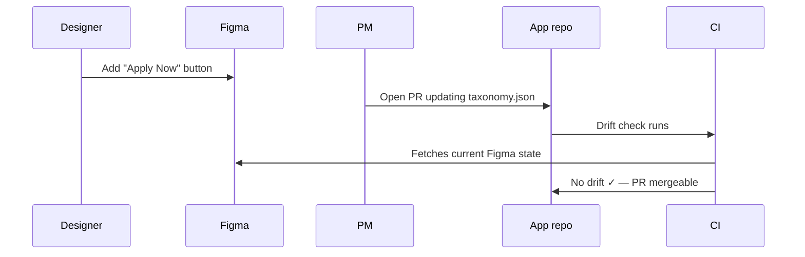
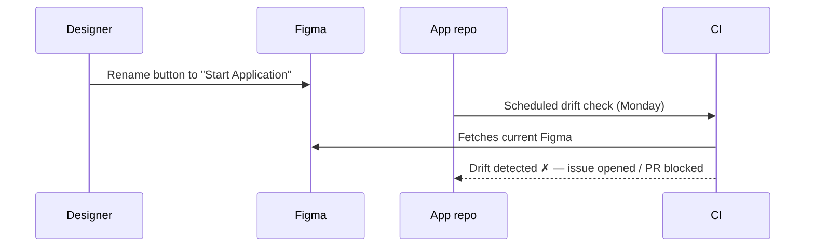

# CI drift checks

The whole point of committing `taxonomy.json` is so CI can tell you when it falls out
of sync with Figma. A composite action is shipped with the repo to make that one step.

## Drop-in action

In your **app** repository (the one with the committed `taxonomy.json`), add:

```yaml title=".github/workflows/taxonomy-drift.yml"
name: Taxonomy drift check

on:
  pull_request:
    paths:
      - "tracking/taxonomy.json"
  schedule:
    - cron: "0 9 * * MON"   # weekly reminder even without PRs

jobs:
  drift:
    runs-on: ubuntu-latest
    steps:
      - uses: actions/checkout@v4
      - uses: arcbaslow/figma-taxonomy-gen/.github/actions/drift-check@v0.4.0
        with:
          taxonomy-path: tracking/taxonomy.json
          figma-url: https://figma.com/design/ABC123/MyApp
          figma-token: ${{ secrets.FIGMA_TOKEN }}
```

The action runs `figma-taxonomy validate --exit-code`. A clean run produces no output;
drift produces a grouped diff and exits non-zero, failing the PR check.

## Inputs

| Input             | Required | Description                                     |
|-------------------|----------|-------------------------------------------------|
| `taxonomy-path`   | yes      | Path to the committed `taxonomy.json`           |
| `figma-url`       | yes      | Figma file URL                                  |
| `figma-token`     | yes      | Figma PAT (pass via `secrets.FIGMA_TOKEN`)      |
| `config-path`     | no       | Path to a custom `taxonomy.config.yaml`         |
| `package-version` | no       | Pin to a specific `figma-taxonomy-gen` version  |

## Recommended PR workflow



When design changes land without a corresponding taxonomy update:



## Patterns

### Regenerate on drift

If you want CI to *apply* the fix rather than just report it, add a second job that
runs `figma-taxonomy extract` and opens a PR. Keep it manual by default — auto-updates
can silently relabel events and break downstream dashboards.

### Multiple Figma files

Run the action once per file:

```yaml
jobs:
  drift-ios:
    uses: arcbaslow/figma-taxonomy-gen/.github/actions/drift-check@v0.4.0
    with:
      taxonomy-path: tracking/ios.json
      figma-url: https://figma.com/design/IOS123/iOSApp
      figma-token: ${{ secrets.FIGMA_TOKEN }}

  drift-android:
    uses: arcbaslow/figma-taxonomy-gen/.github/actions/drift-check@v0.4.0
    with:
      taxonomy-path: tracking/android.json
      figma-url: https://figma.com/design/AND456/AndroidApp
      figma-token: ${{ secrets.FIGMA_TOKEN }}
```

### Posting drift as a PR comment

The composite action prints diff output to the job log. To surface it on the PR, wrap
it in a job that captures stdout and comments via `actions/github-script`. Left as
an exercise since the right UX depends on your team's conventions.
