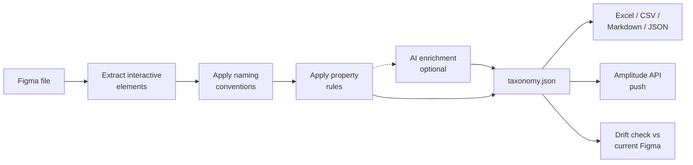

# figma-taxonomy-gen

Extract interactive UI elements from Figma designs and generate an opinionated
[Amplitude](https://amplitude.com) event taxonomy — rule-based by default, optionally
AI-enriched, with drift detection and direct push to Amplitude's Taxonomy API.

## Why this exists

Every team shipping analytics goes through the same cycle: designer creates screens,
PM manually writes a tracking spreadsheet, analyst maps events to business metrics,
developer implements tracking, nobody keeps the spreadsheet in sync. The taxonomy
drifts from the design, and six months later you're debating whether
`button_apply_loan_clicked` and `loan_apply_started` are the same event.

This tool closes the gap between *"design is done"* and *"tracking plan exists,"* and
then keeps them in sync.

## What you get



- **Rule-based extraction.** Detects interactive elements by name pattern, prototype
  interactions, and component type. Builds a screen map from the page/frame hierarchy.
- **Opinionated naming.** Events follow `{screen}_{element}_{action}` with configurable
  action verbs, screen-name cleaning, and per-pattern property rules.
- **Four output formats.** Excel, Amplitude-ready CSV, JSON Schema, and Markdown.
- **Drift detection.** `validate` matches events by Figma `node_id`, so a component
  rename shows up as a rename, not add+remove.
- **AI enrichment (optional).** `--ai` sends one prompt per flow to Claude; suggestions
  merge into the event set without duplicating existing properties.
- **MCP server.** Claude Desktop and claude.ai can call `extract_taxonomy`,
  `validate_taxonomy`, and `export_taxonomy` directly.

## Quick example

```bash
uv pip install figma-taxonomy-gen
export FIGMA_TOKEN="your-figma-pat"
figma-taxonomy extract https://figma.com/design/ABC123/MyApp
```

```
Fetching Figma file: https://figma.com/design/ABC123/MyApp
Extracting interactive elements...
Found 34 interactive elements
Generating taxonomy...
Generated 42 events
  Excel:    ./output/taxonomy.xlsx
  CSV:      ./output/taxonomy.csv
  JSON:     ./output/taxonomy.json
  Markdown: ./output/taxonomy.md
```

Head to [Getting started](getting-started.md) for the walkthrough.
