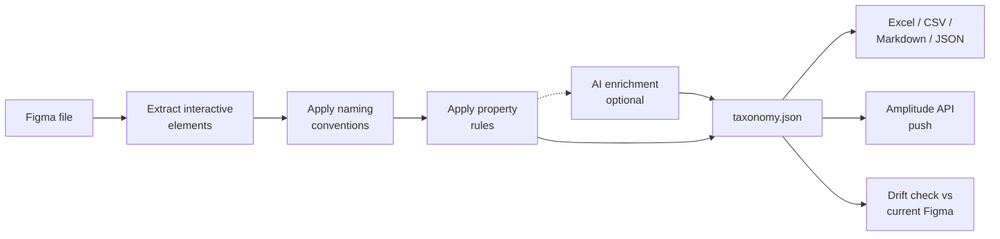

# figma-taxonomy-gen

Pulls interactive elements out of a Figma file and generates an
[Amplitude](https://amplitude.com) event taxonomy. Rule-based by default, optionally
AI-enriched, with drift detection and direct push to Amplitude's Taxonomy API.

## Why this exists

Tracking plans usually live in a spreadsheet that the PM wrote by hand after staring
at Figma for an afternoon. Then the spreadsheet drifts from the design, and six
months later you're debating whether `button_apply_loan_clicked` and
`loan_apply_started` are the same event.

This tool generates the first version of that spreadsheet straight from the design
file, and then keeps the two in sync.

## What you get



- **Rule-based extraction.** Detects interactive elements by name pattern, prototype
  interactions, and component type. Builds a screen map from the page/frame hierarchy.
- **Configurable naming.** Events follow `{screen}_{element}_{action}` with
  configurable action verbs, screen-name cleaning, and per-pattern property rules.
- **Four output formats.** Excel, Amplitude-ready CSV, JSON Schema, and Markdown.
- **Drift detection.** `validate` matches events by Figma `node_id`, so a component
  rename shows up as a rename instead of an add plus a remove.
- **AI enrichment (optional).** `--ai` sends one prompt per flow to Claude;
  suggestions merge into the event set and skip any property names that already exist.
- **MCP server.** Claude Desktop and claude.ai can call `extract_taxonomy`,
  `validate_taxonomy`, and `export_taxonomy` directly.

## Quick example

```bash
uv pip install figma-taxonomy-gen
export FIGMA_TOKEN="your-figma-pat"
figma-taxonomy extract https://figma.com/design/ABC123/MyApp
```

```
Fetching Figma file: https://figma.com/design/ABC123/MyApp
Extracting interactive elements...
Found 34 interactive elements
Generating taxonomy...
Generated 42 events
  Excel:    ./output/taxonomy.xlsx
  CSV:      ./output/taxonomy.csv
  JSON:     ./output/taxonomy.json
  Markdown: ./output/taxonomy.md
```

Head to [Getting started](getting-started.md) for the walkthrough.
